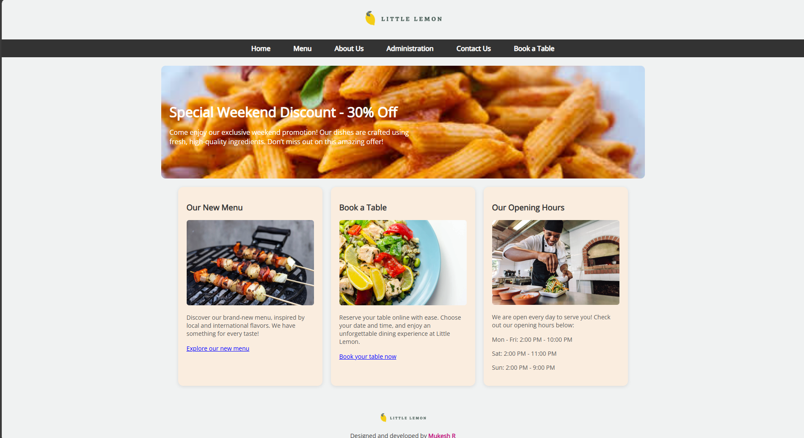
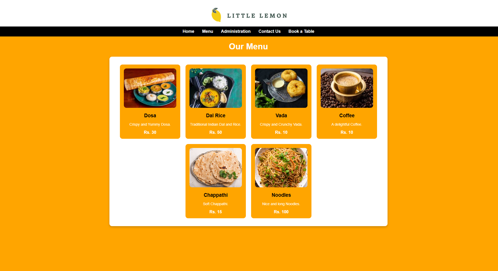
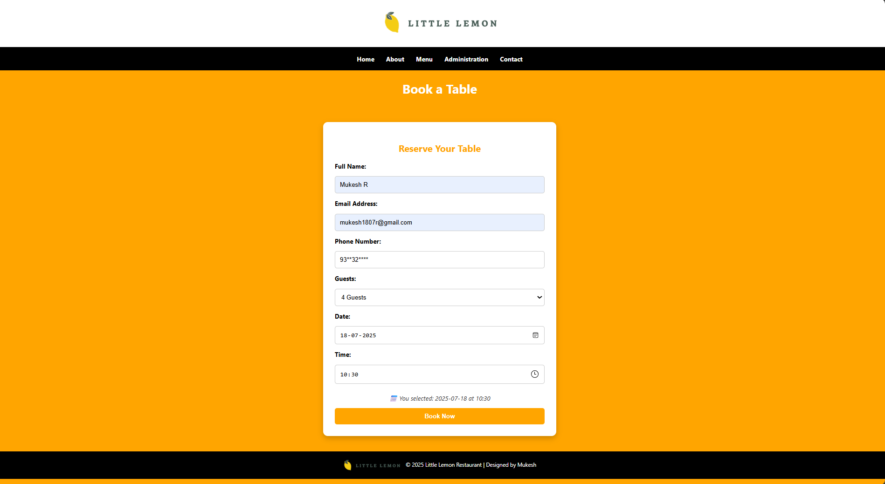
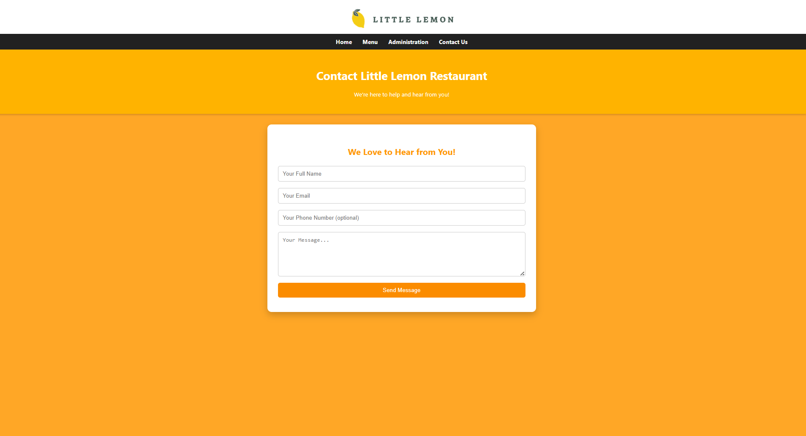
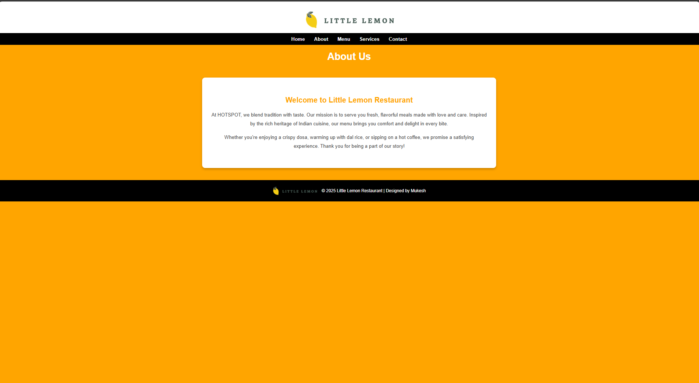
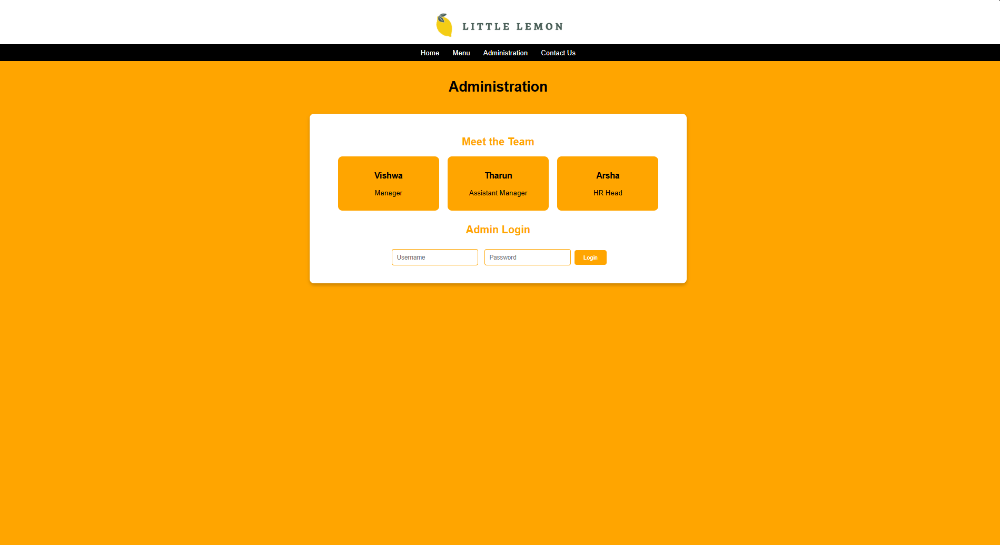

# Ex.07 Restaurant Website
## Date:

## AIM:
To develop a static Restaurant website to display the food items and services provided by them.

## DESIGN STEPS:

### Step 1:
Requirement collection.

### Step 2:
Creating the layout using HTML and CSS.

### Step 3:
Updating the sample content.

### Step 4:
Choose the appropriate style and color scheme.

### Step 5:
Validate the layout in various browsers.

### Step 6:
Validate the HTML code.

### Step 7:
Publish the website in the given URL.

## PROGRAM:

## index.html
```
<!DOCTYPE html>
<html lang="en">
<head>
  <meta charset="UTF-8" />
  <meta name="viewport" content="width=device-width, initial-scale=1.0" />
  <title>Little Lemon</title>
  <link rel="stylesheet" href="style.css" />
  <link href="https://fonts.googleapis.com/css2?family=Open+Sans&family=Montserrat:wght@600&display=swap" rel="stylesheet">
</head>
<body>

  <!-- Header -->
  <header>
    
  </header>

  <!-- Navigation -->
  <nav>
    <a href="index.html">Home</a>
    <a href="menu.html">Menu</a>
    <a href="about.html">About Us</a>
    <a href="administration.html">Administration</a>
    <a href="contact.html">Contact Us</a>
    <a href="book.html">Book a Table</a>
  </nav>

  <!-- Promo Section -->
  <section class="promo">
    <h2>Special Weekend Discount - 30% Off</h2>
    <p>Come enjoy our exclusive weekend promotion! Our dishes are crafted using fresh, high-quality ingredients. Don’t miss out on this amazing offer!</p>
  </section>

  <!-- Cards Section -->
  <section class="cards">
    <!-- First Card -->
    <div class="card">
      <h3>Our New Menu</h3>
      
      <p>Discover our brand-new menu, inspired by local and international flavors. We have something for every taste!</p>
      <a href="menu.html">Explore our new menu</a>
    </div>

    <!-- Second Card -->
    <div class="card">
      <h3>Book a Table</h3>
      
      <p>Reserve your table online with ease. Choose your date and time, and enjoy an unforgettable dining experience at Little Lemon.</p>
      <a href="book.html">Book your table now</a>
    </div>

    <!-- Third Card -->
    <div class="card">
      <h3>Our Opening Hours</h3>
      
      <p>We are open every day to serve you! Check out our opening hours below:</p>
      <div class="hours">
        <p>Mon - Fri: 2:00 PM - 10:00 PM</p>
        <p>Sat: 2:00 PM - 11:00 PM</p>
        <p>Sun: 2:00 PM - 9:00 PM</p>
      </div>
    </div>
  </section>

  <!-- Footer -->
  <footer>
    <div class="footer-logo">
      
    </div>
    <p>Designed and developed by <a href="#">Mukesh R</a></p>
  </footer>

</body>
</html>
```
## Menu.html
```
<!DOCTYPE html>
<html>
<head>
    <title>Menu</title>
    <style>
        body {
            font-family: Arial, sans-serif;
            margin: 0;
            padding: 0;
            background-color: orange;
        }

        /* Logo Section */
        .logo-container {
            text-align: center;
            padding: 20px 10px 0;
            background-color: white;
        }

        .logo-container img {
            height: 80px;
        }

        nav {
            background-color: black;
            color: white;
            display: flex;
            justify-content: center;
            padding: 10px 0;
        }

        nav a {
            text-decoration: none;
            color: white;
            margin: 0 15px;
            font-weight: bold;
        }

        header {
            text-align: center;
            background-color: orange;
            padding: 20px;
        }

        header h1 {
            margin: 0;
            color: white;
        }

        .menu-section {
            padding: 30px;
            max-width: 1000px;
            margin: auto;
            background-color: white;
            border-radius: 10px;
            box-shadow: 0 4px 8px rgba(0, 0, 0, 0.2);
        }

        .menu-grid {
            display: flex;
            flex-wrap: wrap;
            gap: 20px;
            justify-content: center;
        }

        .menu-item {
            background-color: orange;
            border-radius: 10px;
            padding: 15px;
            text-align: center;
            width: 200px;
        }

        .menu-item img {
            width: 100%;
            height: 150px;
            border-radius: 10px;
            object-fit: cover;
            margin-bottom: 10px;
        }

        .menu-item h3 {
            margin: 5px 0;
        }

        .menu-item p {
            font-size: 14px;
            color: white;
        }

        .price {
            font-weight: bold;
            color: white;
        }
    </style>
</head>
<body>

    <!-- Logo -->
    <div class="logo-container">
        
    </div>

    <!-- Navigation -->
    <nav>
        <a href="index.html">Home</a>
        <a href="menu.html">Menu</a>
        <a href="administration.html">Administration</a>
        <a href="contact.html">Contact Us</a>
        <a href="book.html">Book a Table</a>
    </nav>

    <!-- Header -->
    <header>
        <h1>Our Menu</h1>
    </header>

    <!-- Menu Items -->
    <div class="menu-section">
        <div class="menu-grid">
            <div class="menu-item">
                
                <h3>Dosa</h3>
                <p>Crispy and Yummy Dosa.</p>
                <div class="price">Rs. 30</div>
            </div>
            <div class="menu-item">
                
                <h3>Dal Rice</h3>
                <p>Traditional Indian Dal and Rice.</p>
                <div class="price">Rs. 50</div>
            </div>
            <div class="menu-item">
                
                <h3>Vada</h3>
                <p>Crispy and Crunchy Vada.</p>
                <div class="price">Rs. 10</div>
            </div>
            <div class="menu-item">
                
                <h3>Coffee</h3>
                <p>A delightful Coffee.</p>
                <div class="price">Rs. 10</div>
            </div>
            <div class="menu-item">
                
                <h3>Chappathi</h3>
                <p>Soft Chappathi.</p>
                <div class="price">Rs. 15</div>
            </div>
            <div class="menu-item">
                
                <h3>Noodles</h3>
                <p>Nice and long Noodles.</p>
                <div class="price">Rs. 100</div>
            </div>
        </div>
    </div>

</body>
</html>
```
## Book.html
<!DOCTYPE html>
<html lang="en">
<head>
  <meta charset="UTF-8" />
  <meta name="viewport" content="width=device-width, initial-scale=1.0"/>
  <title>Advanced Booking - Restaurant</title>
  <style>
    * {
      box-sizing: border-box;
    }

    body {
      font-family: 'Segoe UI', sans-serif;
      margin: 0;
      background-color: orange;
    }

    .logo-container {
      text-align: center;
      padding: 20px;
      background-color: white;
    }

    .logo-container img {
      height: 80px;
    }

    nav {
      background-color: black;
      display: flex;
      justify-content: center;
      flex-wrap: wrap;
      padding: 10px;
    }

    nav a {
      color: white;
      text-decoration: none;
      margin: 10px 15px;
      font-weight: bold;
      transition: color 0.3s;
    }

    nav a:hover {
      color: orange;
    }

    header {
      background-color: orange;
      text-align: center;
      padding: 25px 15px;
    }

    header h1 {
      color: white;
      margin: 0;
    }

    .booking-section {
      background-color: white;
      max-width: 600px;
      margin: 40px auto;
      padding: 30px;
      border-radius: 12px;
      box-shadow: 0 6px 14px rgba(0, 0, 0, 0.2);
    }

    .booking-section h2 {
      text-align: center;
      color: orange;
      margin-bottom: 20px;
    }

    .booking-form {
      display: flex;
      flex-direction: column;
      gap: 16px;
    }

    label {
      font-weight: bold;
    }

    input, select, button {
      padding: 12px;
      font-size: 16px;
      border: 1px solid #ccc;
      border-radius: 6px;
      transition: border-color 0.3s;
    }

    input:focus, select:focus {
      border-color: orange;
      outline: none;
    }

    button {
      background-color: orange;
      color: white;
      font-weight: bold;
      cursor: pointer;
      border: none;
      transition: background-color 0.3s;
    }

    button:hover {
      background-color: darkorange;
    }

    #confirmation {
      text-align: center;
      margin-top: 20px;
      color: green;
      font-weight: bold;
      display: none;
    }

    /* Live preview */
    #preview {
      text-align: center;
      margin-top: 10px;
      color: #333;
      font-style: italic;
    }

    footer {
      background-color: black;
      color: white;
      text-align: center;
      padding: 15px 0;
      margin-top: 40px;
    }

    footer img {
      height: 40px;
      vertical-align: middle;
      margin-right: 10px;
    }

    footer p {
      display: inline;
      font-size: 14px;
    }

    @media (max-width: 600px) {
      nav {
        flex-direction: column;
        align-items: center;
      }
    }
  </style>
</head>
<body>

  <!-- Logo -->
  <div class="logo-container">
    
  </div>

  <!-- Navigation -->
  <nav>
    <a href="index.html">Home</a>
    <a href="about.html">About</a>
    <a href="menu.html">Menu</a>
    <a href="administration.html">Administration</a>
    <a href="contact.html">Contact</a>
  </nav>

  <!-- Header -->
  <header>
    <h1>Book a Table</h1>
  </header>

  <!-- Booking Form -->
  <div class="booking-section">
    <h2>Reserve Your Table</h2>
    <form class="booking-form" id="bookingForm">
      <label for="name">Full Name:</label>
      <input type="text" name="name" id="name" placeholder="Your Full Name" required>

      <label for="email">Email Address:</label>
      <input type="email" name="email" id="email" placeholder="you@example.com" required>

      <label for="phone">Phone Number:</label>
      <input type="tel" name="phone" id="phone" placeholder="123-456-7890" required>

      <label for="guests">Guests:</label>
      <select name="guests" id="guests" required>
        <option value="" disabled selected>Choose number of guests</option>
        <option value="1">1 Guest</option>
        <option value="2">2 Guests</option>
        <option value="3">3 Guests</option>
        <option value="4">4 Guests</option>
        <option value="5">5 Guests</option>
        <option value="6+">6+ Guests</option>
      </select>

      <label for="date">Date:</label>
      <input type="date" name="date" id="date" required>

      <label for="time">Time:</label>
      <input type="time" name="time" id="time" required>

      <div id="preview"></div>

      <button type="submit">Book Now</button>
    </form>

    <div id="confirmation">✅ Your booking has been submitted!</div>
  </div>

  <!-- Footer -->
  <footer>
    
    <p>© 2025 Little Lemon Restaurant | Designed by Mukesh</p>
  </footer>

  <script>
    const form = document.getElementById('bookingForm');
    const confirmation = document.getElementById('confirmation');
    const preview = document.getElementById('preview');
    const dateInput = document.getElementById('date');
    const timeInput = document.getElementById('time');

    form.addEventListener('submit', function(event) {
      event.preventDefault();
      confirmation.style.display = 'block';
      form.reset();
      preview.innerHTML = '';
    });

    // Live preview of date and time
    function updatePreview() {
      const date = dateInput.value;
      const time = timeInput.value;
      if (date && time) {
        preview.textContent = `📅 You selected: ${date} at ${time}`;
      } else {
        preview.textContent = '';
      }
    }

    dateInput.addEventListener('change', updatePreview);
    timeInput.addEventListener('change', updatePreview);
  </script>

</body>
</html>
```

## Style.css
```
body {
    margin: 0;
    font-family: 'Open Sans', sans-serif;
    background-color: #f0f2f2;
}

header {
    text-align: center;
    padding: 20px 0;
}

header img {
    height: 50px;
}

header h1 {
    display: inline-block;
    margin-left: 10px;
    font-family: 'Montserrat', sans-serif;
    color: #2d3e3f;
    vertical-align: middle;
}

nav {
    background-color: #333;
    padding: 10px 0;
    text-align: center;
}

nav a {
    color: white;
    text-decoration: none;
    margin: 0 25px;
    font-weight: bold;
    font-size: 16px;
}

.promo {
    background-image: url('image/backgroundhead1.jpeg');
    background-size: cover;
    background-position: center;
    color: white;
    padding: 60px 20px;
    text-align: left;
    border-radius: 10px;
    margin: 20px auto;
    width: 90%;
    max-width: 1100px;
}

.promo h2 {
    font-size: 32px;
    margin-bottom: 10px;
}

.promo p {
    max-width: 600px;
}

.cards {
    display: flex;
    flex-wrap: wrap;
    justify-content: center;
    gap: 20px;
    margin: 20px auto;
    max-width: 1100px;
}

.card {
    background-color: #faeddf;
    padding: 20px;
    border-radius: 12px;
    width: 300px;
    box-shadow: 0 2px 8px rgba(0,0,0,0.1);
}

.card img {
    width: 100%;
    border-radius: 6px;
}

.card h3 {
    margin-top: 15px;
    color: #333;
}

.card p {
    font-size: 14px;
    color: #555;
}

.card a {
    color: blue;
    text-decoration: underline;
    font-size: 14px;
}

footer {
    margin-top: 40px;
    padding: 20px;
    text-align: center;
    font-size: 14px;
    color: #333;
}

footer a {
    text-decoration: none;
    color: #c71585;
    font-weight: bold;
}

.footer-logo img {
    height: 30px;
}

.hours {
    margin-top: 15px;
    font-size: 14px;
    color: #333;
}

```


## OUTPUT:

## Home 

## Menu

## Booking 

## Contact 

## About 

## Adminstration

## RESULT:
The program for designing software company website using HTML and CSS is completed successfully.
